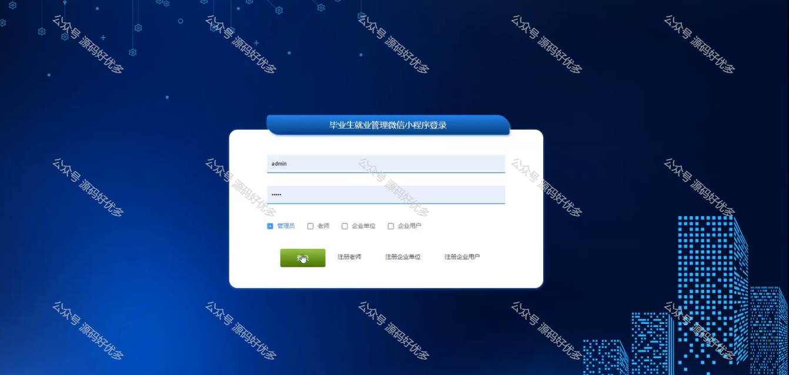

 
## 查看主页获取源码

> **作者介绍**： **✌**全网粉丝10W+本平台特邀作者、博客专家、CSDN新星计划导师、java领域优质创作者,博客之星、掘金/华为云/阿里云/InfoQ等平台优质作者、专注于项目实战 **✌**

  

### 一、作品包含

源码+数据库+设计文档万字+PPT+全套环境和工具资源+部署教程

### 二、项目技术

前端技术：Html、Css、Js、Vue、Element-ui

数据库：MySQL

后端技术：Java、Spring Boot、MyBatis

  

### 三、运行环境

开发工具：IDEA/eclipse + 微信开发者工具

数据库：MySQL5.7

数据库管理工具：Navicat10以上版本

环境配置软件： JDK1.8+Maven3.6.3

前端Nodejs：14

### 四、项目介绍
项目编号：mpweixinA015

"毕业生就业管理"微信小程序，立足于服务广大高校毕业生和用人单位，以促进就业为宗旨，搭建了一个高效便捷的就业信息平台，旨在帮助毕业生及时了解就业市场动态，提升求职技能，实现顺利就业。同时，也为企业提供了人才招聘的快捷通道，促进了学校、学生与企业之间的信息交流，共同推动毕业生就业工作的信息化、智能化发展。

前台用户功能：首页、招聘信息、宣教会、双选会、个人简历、投递简历、学生邀约、企业邀约、学生应约、企业应约、我的收藏管理。

后台分为管理员、教师、企业用户、企业单位
管理员的功能：系统首页、个人中心、毕业生管理、老师管理、企业单位管理、企业用户管理、学院信息管理、专业信息管理、班级信息管理、资质申请管理、个人简历管理、招聘信息管理、宣教会议管理、双选会管理、投递简历管理、学生邀约管理、企业邀约管理、学生应约管理、企业应约管理、已就业毕业生管理、企业用户申请管理、系统管理。
教师的功能：系统首页、个人中心、毕业生管理、学生邀约管理、企业邀约管理、学生应约管理、企业应约管理。
企业用户的功能：系统首页、个人中心、企业用户申请管理。
企业单位的功能：系统首页、个人中心、资质申请管理、个人简历管理、招聘信息管理、宣教会管理、双选会管理、投递简历管理、学生邀约管理、企业邀约管理、学生应约管理、企业应约管理。

### 五、运行截图

  
